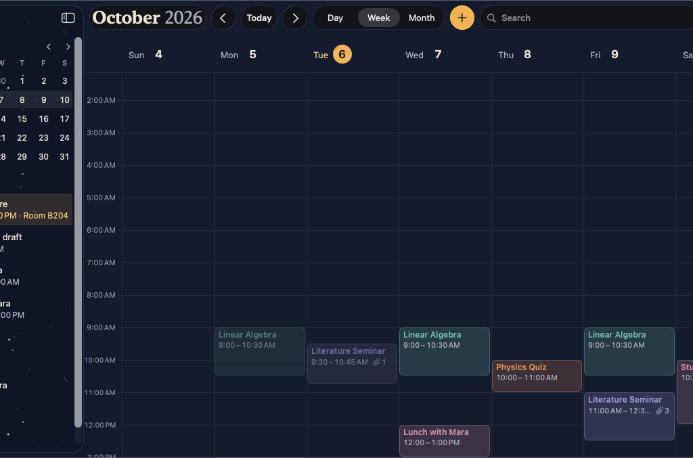
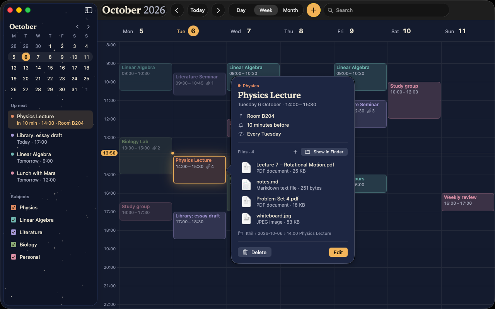
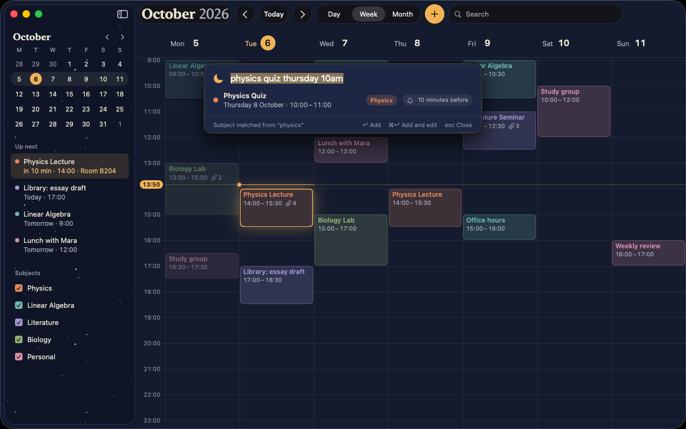
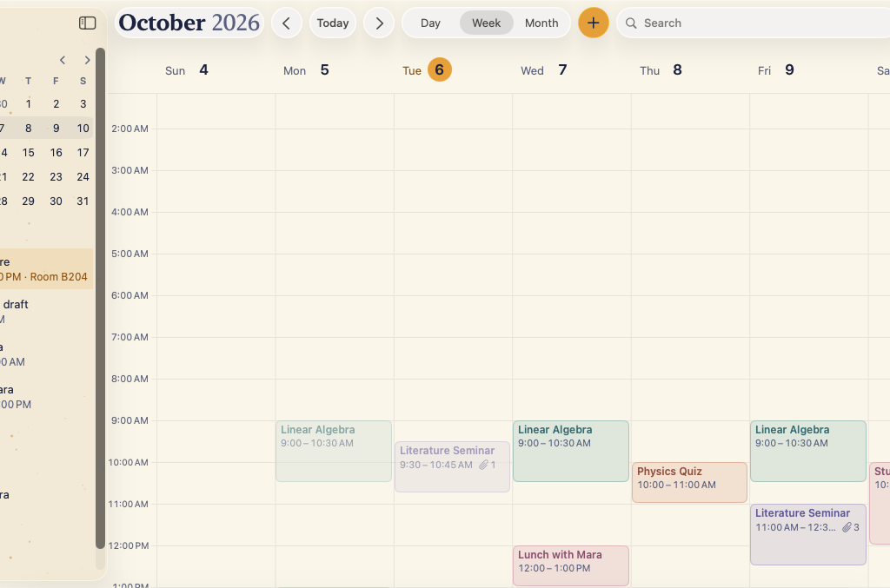
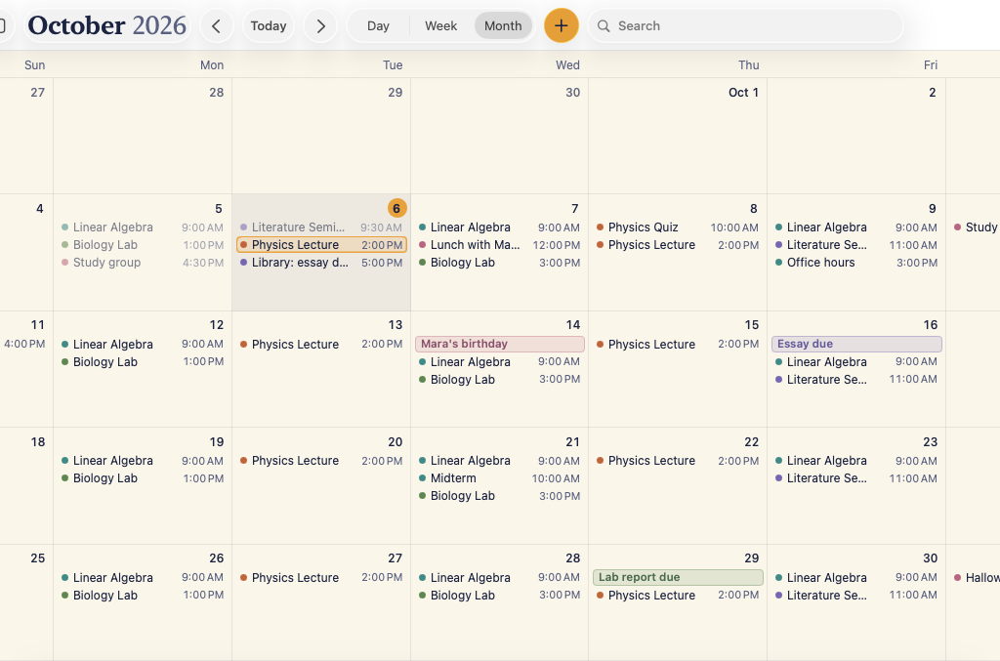

<p align="center">
  
</p>

<h1 align="center">Ithil</h1>

<p align="center">
  <strong>A fast, offline, private calendar for students on the Mac. Every event's files live in real Finder folders.</strong>
</p>

<p align="center">
  <a href="https://github.com/Visaug36/Ithil/releases/latest">Download</a> ·
  <a href="#build-from-source">Build from source</a> ·
  <a href="#keyboard-shortcuts">Shortcuts</a> ·
  <a href="#faq">FAQ</a>
</p>

<p align="center">
  
</p>

## Features

- **Week, Day and Month views.** The sidebar has a mini month, what's up next, and your subjects with toggles
  to show or hide them. Search covers titles, locations and notes.
- **Events the way a student thinks about them:** a time or all day, a subject, a location, an alert, and repeats
  (daily, weekly or monthly), with "this event" or "all future events" when you change one.
- **Quick Add from anywhere.** Press <kbd>⌥</kbd><kbd>Space</kbd> (or <kbd>⌘</kbd><kbd>N</kbd> in Ithil) and type
  "physics quiz thursday 10am". Ithil works out the date, the time and the subject.
- **Files that live in Finder.** Drop slides, problem sets or photos on an event and they're copied into
  `Ithil/2026-10-06/14.00 Physics Lecture/`, a real folder you can open, sync or back up like any other. Ithil
  shows changes you make in Finder straight away, and renames or moves the folder when you edit the event.
- **Notifications that work while Ithil is quit:** "Physics Lecture in 10 min", with "14:00 – 15:30 · Room B204 ·
  4 files" underneath and an **Open Files** button.
- **Feels like it shipped with the Mac:** Night and Dawn appearances (or follow the system), a menu bar extra,
  full keyboard control, VoiceOver, Reduce Motion and Increase Contrast.
- **Private by design:** no network access at all, no accounts, no analytics, no third-party code.

<p align="center">
  
  
</p>
<p align="center">
  
  
</p>

## Download

1. Download **Ithil-x.y.z.zip** from the [latest release](https://github.com/Visaug36/Ithil/releases/latest) and
   double-click it to unzip.
2. Drag **Ithil** to your **Applications** folder.
3. Open it. Ithil isn't notarized by Apple (that needs a paid developer account), so the first time macOS says it
   can't verify the developer:
   - Open **System Settings → Privacy & Security**.
   - Scroll to the message about Ithil and click **Open Anyway**, then confirm.

   You only need to do this once. To check the download, compare its SHA-256 with the `.sha256` file on the
   release page: `shasum -a 256 Ithil-x.y.z.zip`.

Requires macOS 14 Sonoma or later, on Apple silicon or Intel.

### First launch

Ithil asks where to keep your calendar. **Create Ithil Folder…** suggests `~/Documents/Ithil`, or you can use any
folder you like, including one in iCloud Drive, Dropbox or on an external drive. If you pick a folder that already
has other things in it, Ithil makes an `Ithil` folder inside it. Then it explains notifications before macOS asks,
and you're done.

## How your files are stored

Everything lives in the folder you chose. It's plain files, so copying the folder is a full backup:

```
Ithil/
├── .ithil/
│   ├── events.json                 your events and subjects (JSON, schema-versioned)
│   └── backups/                    rolling backups of events.json
├── 2026-10-06/
│   ├── 09.30 Literature Seminar/
│   └── 14.00 Physics Lecture/      one folder per event, created when its first file arrives
│       ├── Lecture 7 – Rotational Motion.pdf
│       ├── Problem Set 4.pdf
│       └── notes.md
└── 2026-10-14/
    └── Mara's birthday/            all-day events have no time in the name
```

- Each occurrence of a repeating event gets its own folder.
- Files you drop are **copied**; the originals stay where they were. Name clashes get " 2", like in Finder.
- Rename a folder in Finder and Ithil still finds it (a small hidden `.ithil-event` file inside remembers which
  event it belongs to).
- Deleting an event moves its folder to the **Trash**, after asking if it has files. Ithil never deletes anything
  permanently.
- If `events.json` ever gets damaged, Ithil restores the newest good backup, tells you, and keeps the damaged file
  next to it.

## Keyboard shortcuts

| Action | Shortcut |
|---|---|
| Quick Add (anywhere; change it in Settings) | <kbd>⌥</kbd><kbd>Space</kbd> |
| Quick Add in Ithil | <kbd>⌘</kbd><kbd>N</kbd> |
| Add, or add and open the editor | <kbd>↩</kbd> / <kbd>⌘</kbd><kbd>↩</kbd> (in Quick Add) |
| Go to today | <kbd>⌘</kbd><kbd>T</kbd> |
| Previous / next day, week or month | <kbd>←</kbd> / <kbd>→</kbd> (or <kbd>⌘</kbd><kbd>←</kbd> / <kbd>⌘</kbd><kbd>→</kbd>) |
| Day, Week, Month | <kbd>⌘</kbd><kbd>1</kbd>, <kbd>⌘</kbd><kbd>2</kbd>, <kbd>⌘</kbd><kbd>3</kbd> |
| Search | <kbd>⌘</kbd><kbd>F</kbd> |
| Delete the selected event | <kbd>Delete</kbd> |
| Move the selected event 15 minutes | <kbd>⌥</kbd><kbd>↑</kbd> / <kbd>⌥</kbd><kbd>↓</kbd> |
| Change its end by 15 minutes | <kbd>⌥</kbd><kbd>⇧</kbd><kbd>↑</kbd> / <kbd>⌥</kbd><kbd>⇧</kbd><kbd>↓</kbd> |
| Undo / Redo | <kbd>⌘</kbd><kbd>Z</kbd> / <kbd>⇧</kbd><kbd>⌘</kbd><kbd>Z</kbd> |
| Quick Look a file in an event | <kbd>Space</kbd> |
| Settings | <kbd>⌘</kbd><kbd>,</kbd> |

You can also drag events to move them, and drag their bottom edge to change how long they last.

## Privacy

- **No network.** Ithil runs in the App Sandbox without the network entitlement, so macOS itself stops it from
  going online. "Check for Updates…" and "Report an Issue…" just open GitHub in your browser.
- **No analytics, no accounts, no tracking**, and no third-party code.
- **Everything stays in your folder**, plus one safety copy of `events.json` in Ithil's own container in
  `~/Library/Containers/io.github.visaug36.Ithil/`. Ithil only ever reads and writes inside the folder you chose.

## Backup and moving to a new Mac

- **Backup:** copy your Ithil folder, or let Time Machine do it. It's a complete backup: events, subjects and every
  file.
- **New Mac:** copy the folder over (or keep it in iCloud Drive), install Ithil, and choose **Use Existing Folder…**
  on first launch. Everything is back.
- **Moving the folder:** Settings → Files → **Change…** offers to move your calendar and its files to the new place.

## Uninstall

1. Quit Ithil (<kbd>⌘</kbd><kbd>Q</kbd>, or Quit Ithil in the menu bar moon).
2. Drag `/Applications/Ithil.app` to the Trash.
3. Optional: delete `~/Library/Containers/io.github.visaug36.Ithil` (settings and the safety copy).

Your Ithil folder with your events and files stays where it is until you delete it yourself.

## FAQ

**Notifications don't show up.**
Open **System Settings → Notifications → Ithil** and make sure **Allow notifications** is on. Ithil's Settings →
General shows the status and has a button that takes you there. Also check that the event has an alert (the bell
in its details) and that Focus isn't hiding notifications. Each time it runs, Ithil schedules the alerts for the
next two weeks (up to 48), so if it hasn't been open for longer than that, open it once, or turn on **Launch at
login** in Settings → General.

**Ithil says it can't find its folder.**
The folder was moved, renamed, deleted, or it's on a drive that isn't connected. Plug the drive back in, or click
**Locate Folder…** and point Ithil to where the folder is now. Ithil never starts over with an empty calendar
without asking.

**⌥Space doesn't open Quick Add.**
Another app (or a macOS shortcut) may already use it. Pick a different shortcut in Settings → General; Ithil tells
you when the one you chose is taken.

**Can I edit events.json by hand?**
Yes, with Ithil quit. If you make a mistake Ithil can't read, it restores the newest good backup and keeps your
edited file next to it.

**Does Ithil sync between Macs?**
Not by itself, but it works with any folder sync: put your Ithil folder in iCloud Drive or Dropbox. Use it on one
Mac at a time.

## Build from source

Ithil runs on macOS 14 or later. To build it you need Xcode 26, which runs on macOS 15.6 or later.

```sh
git clone https://github.com/Visaug36/Ithil.git
cd Ithil
open Ithil.xcodeproj        # then ⌘R to run, ⌘U to test
scripts/install.sh          # or build Release and install it in /Applications
```

To try Ithil with sample data that never touches your own calendar, turn on the `-demo` launch argument
(Product → Scheme → Edit Scheme… → Run → Arguments), and `-demoNow 2026-10-06T13:50` to pin the clock.

There are no dependencies. The logic lives in `IthilCore` with Swift Testing tests. See
[docs/ARCHITECTURE.md](docs/ARCHITECTURE.md) and [docs/DESIGN.md](docs/DESIGN.md).

## Contributing

Issues and pull requests are welcome. Please read [CONTRIBUTING.md](CONTRIBUTING.md) and the
[Code of Conduct](CODE_OF_CONDUCT.md) first. Security problems go through
[private vulnerability reporting](SECURITY.md).

## License

[MIT](LICENSE) © 2026 Visaug36.

"Ithil" is the Sindarin word for the Moon in J.R.R. Tolkien's writings. This project isn't affiliated with or
endorsed by the Tolkien Estate.
